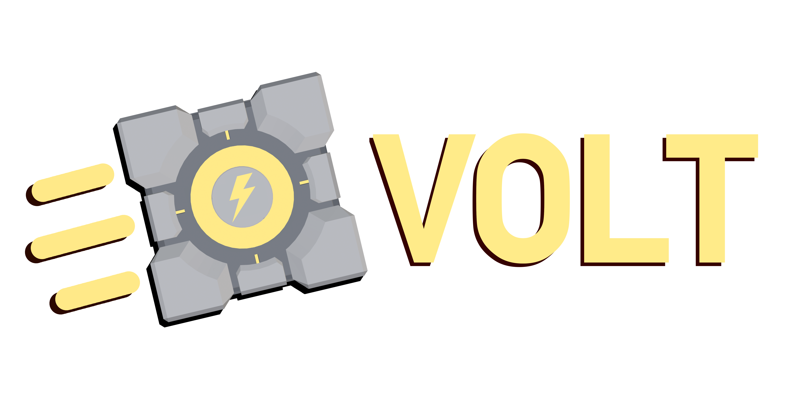

## What is Volt? ⚡

Volt (VPhysics Jolt) is a replacement for Source's VPhysics which uses IVP/Havok using [Jolt Physics](https://github.com/jrouwe/JoltPhysics/) 
Created by [Joshua Ashton (🐸✨)](https://github.com/Joshua-Ashton) [@phys_ballsocket](https://twitter.com/phys_ballsocket) and [Josh Dowell (Slartibarty)](https://github.com/Slartibarty) [@Slartbarty](https://twitter.com/Slartbarty).

Volt is designed to be incredibly high performance, supporting thousands of objects at once without bringing tick/framerate down to a crawl.

In our testing, the performance overhead from having thousands of objects moving at once, now comes from the client code needing to update/render, as going out of the PVS of these objects will still cause them to be simulated, but will no longer be rendered.

## Features

Volt is mostly feature complete, but is missing some things such as support for raycast vehicles, breakable constraints, and perhaps other things we've missed!

It is our goal to implement any missing features at some point.

Below is a feature table of Volt vs VPhysics and the Bullet VPhysics project.
If we missed anything we don't support or we do, feel free to add to it.
It is not meant to be a bash on anyone elses work however, the Bullet VPhysics project was a great inspiration to us!

| Feature       | VPhysics | Volt (VPhysics Jolt) | Bullet VPhysics |
|:--------------|:--------:|:-------------:|:---------------:|
| Constraints (except Pulleys)                                  | ✔️ | ✔️ | ✔️ |
| Pulleys                                                       | ✔️ | ❌ | ❌ |
| Breakable constraints                                         | ✔️ | ❌ | ❌ |
| Motors (Motion Controllers)                                   | ✔️ | ✔️ | ✔️ |
| Motors (Constraint)                                           | ✔️ | ✔️ | ❌ |
| Ragdolls                                                      | ✔️ | ✔️ (some bugs) | ✔️ |
| Triggers                                                      | ✔️ | ✔️ | ❌ |
| Object touch callbacks                                        | ✔️ | ✔️ | ❌ |
| Prop damage/breaking                                          | ✔️ | ✔️ | ❌ |
| Fluid events                                                  | ✔️ | ✔️ | ❌ |
| Prop splashing effects                                        | ✔️ | ✔️ | ❌ |
| Wheeled Vehicles                                              | ✔️ | ✔️ | ✔️ |
| Raycast Vehicles (ie. Airboat)                                | ✔️ | ❌ | 〰️ (janky) |
| NPCs/Doors (Shadow Controllers)                               | ✔️ | ✔️ | ✔️ |
| Save/Restore Support                                          | ✔️ | ✔️ | ❌ |
| Portal Support                                                | ✔️ | ✔️ | ❌ |
| Game per-object collide callback support eg. no-collide    | ✔️ | ✔️ | ❌ |
| Crash-resistant solver                                        | ❌ | ✔️ | (no data) |
| Supports thousands of objects without lag                     | ❌ | ✔️ | ❌ |
| Multithreaded                                                 | ❌ | ✔️ | ✔️ (partially) |
| Proper player controller                                      | ✔️ | ❌ (needs work!) | ✔️ (partially) |

## Bugs

VPhysics Jolt is not without its flaws, however. See the [issue tracker](https://github.com/Joshua-Ashton/VPhysics-Jolt/issues) for bugs that are known.

There are definitely going to be bugs that we don't know about or haven't encountered, or different quirks across engine branches.

## How to build

The Volt code is provided as-is, it is up to you to build it for your SDK, etc.

Volt should build fine against Source SDK 2013 and Alien Swarm SDK on a MSVC or GCC compiler with at least C++20 support.

*If you are building directly against the public SDK 2013 and Alien Swarm SDKs, you will need to do minor work to memoverride.cpp to make it compatible with the newer compilers and newer Windows SDKs.*

Unfortunately we cannot redistribute the additional code/headers needed to build Volt for games such as Garry's Mod which uses a different VPhysics interface (CS:GO's) to what is found in the Valve-provided public SDKs.

For full build instructions pertaining to SDK 2013, refernce [build.md](/build.md).

## Download

Development builds for each commit for SDK2013 SP/MP + ASW are available as artifacts on each commit on GitHub through GitHub Actions. 
Development builds for each commit for Garry's Mod are available on [froggi.es](https://git.froggi.es/joshua/vphysics_jolt_gmod_builds).

For each release, binary builds are provided for Garry's Mod and Source SDK 2013 on the [Releases](https://github.com/Joshua-Ashton/VPhysics-Jolt/releases/) page.

## Media

### Lots of Melons + Dumpster

### Physically Simulated Chain

### Lots of Balls Test

### Wheels + Weld Car Dupe Test

### Door + NPC (Physics Shadowed Objects) Test
 Test")

### Lots of Cubes + Ragdolls + Funnel

### Slow Mo Cubes

### Propane in Dumpster

*Have some cool media of stuff going on in Volt you'd like to add? Feel free to make a pull request!*

## Projects using Volt

### [Portal 2: Desolation](https://emberspark.games/desolation/)

### [Prelude: Online](https://prelude.online/)

# Have fun! 🐸⚡
